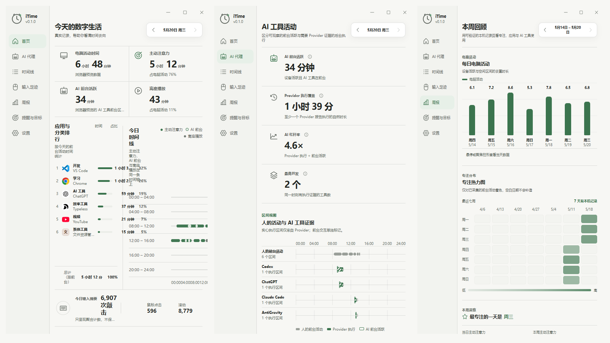

# iTime

### 记录你的屏幕时间，也记录 AI 替你工作的时间

**本地优先 · 隐私友好 · Windows 桌面**

[⬇️ 下载安装](#-下载安装) · [✨ 功能特性](#-功能特性) · [❓ 常见问题](#-常见问题) · [🔒 隐私](#-隐私说明)

---

## 为什么选择 iTime？

一天开了十几个应用、又和 AI 工具来回切换——时间到底花在哪？

**iTime** 是一款 Windows 本地桌面应用：自动记录前台应用占用，单独标出 AI 工具的前台时间，用首页、时间线、周报帮你看清节奏。数据只留在你电脑上，不上传云端。

- 🖥️ **看清屏幕时间** — 今日概览、应用分布，一眼知道时间去哪了
- 🤖 **单独看 AI** — 区分普通应用与 AI 工具的前台占用（估算，诚实标注）
- 📅 **时间线 + 周报** — 按时间回看切换轨迹，用一周趋势复盘
- ⌨️ **输入足迹** — 有本机键鼠数据时，展示活跃与节奏（不会偷看你敲了什么）
- 🎯 **目标与提醒** — 为自己设定使用边界，而不是被算法推着走
- 🔒 **本地优先** — 不上传使用数据；不读窗口标题、文档名、对话和具体按键内容

---

## ✨ 功能特性

### 📊 首页与概览

- 今日屏幕时间、节奏与重点应用
- 关键信息一目了然，适合每天打开看一眼

### 🤖 AI 代理

- 聚焦 AI 相关工具的前台使用情况
- 无法可靠统计时标为「估算」或「暂无」，**不用假数据凑满**

### 🕐 时间线

- 按时间顺序浏览应用切换
- 回看某一时段你到底在忙什么

### ⌨️ 输入足迹

- 键鼠活跃与输入节奏（本机有可用数据时）
- 若安装了 KeyStats，iTime **只读**接入日级统计，不改动其文件或启动项

### 📈 周报

- 一周趋势、常用应用与成就感摘要
- 适合周末快速复盘

### 🎯 目标与 ⚙️ 设置

- 使用提醒与目标
- 主题、开机自启、暂停记录等偏好
- 自启动只管理 iTime 自己，不影响其他软件

> 账户 / Pro 入口为预留能力，当前版本以本机功能为主。

---

## 🖼️ 界面预览

| 产品原型 |
| :------: |
|  |

---

## 🚀 快速开始

1. 从 [Releases](https://github.com/lingcang728/iTime/releases) 下载安装包或便携版
2. 安装并打开 iTime（或直接运行 `iTime.exe`）
3. 保持应用按你期望的方式运行，开始累积本机记录
4. 过一会儿再看 **首页 / 时间线 / 周报** —— 数据会越用越有意义

> ⚠️ **重要**：iTime **不会**回填安装之前的历史。从启用后才开始记。

---

## ⬇️ 下载安装

### 系统要求

| 项目 | 要求 |
| --- | --- |
| 操作系统 | Windows 10 / 11（64 位） |
| 运行时 | [WebView2](https://developer.microsoft.com/microsoft-edge/webview2/)（多数电脑已自带） |
| 权限 | 安装包为「当前用户」模式，一般**不需要**管理员权限 |

### 选择合适的包

从 **[Releases · v0.1.0](https://github.com/lingcang728/iTime/releases/tag/v0.1.0)** 下载：

| 文件 | 说明 | 推荐 |
| --- | --- | :---: |
| `iTime_0.1.0_x64-setup.exe` | 安装版，可进开始菜单 | ✅ |
| `iTime.exe` | 便携版，双击即用 | 需要免安装时 |

请只从本仓库 Releases 获取安装包，避免第三方转载。

---

## 💡 使用前请了解

| | |
| --- | --- |
| 🆕 **从启用后开始记** | 打开并保持运行后，才会持续采样前台应用；安装前的时间不会自动补上 |
| 🤖 **AI 时长是估算** | 统计的是「该 AI 工具是否在前台」，不等于后台 agent 真正跑了多久 |
| ⌨️ **键鼠数据可选** | 有 KeyStats 数据时只读接入；历史做不到的细项会标为不可用 |
| ⏸️ **可随时暂停** | 设置里可暂停记录，也可开关开机自启 |

---

## ❓ 常见问题

<strong>为什么装完几乎是空的？</strong>

 

数据从启用后开始累积。用一段时间再回来看首页和周报会更有参考价值。

<strong>为什么有的数字写着「估算」或「暂无」？</strong>

 

没有可靠来源时，iTime 宁可空着或标明估算，也不会伪造曲线和 0 值。

<strong>关闭窗口后还在记吗？</strong>

 

取决于你的设置与托盘行为（退出 / 后台保留）。需要完整记录时，请确认应用在按你期望的方式运行，且未处于「暂停记录」。

<strong>会不会偷看我敲了什么、开了哪个文档？</strong>

 

不会。iTime **不**读取或保存窗口标题、文档名、对话内容、具体按键内容；也**不**保存完整程序路径、用户名等敏感标识。

<strong>数据存在哪？会上传吗？</strong>

 

活动记录保存在本机（本地数据目录）。当前版本**不会**把使用数据上传到我们的服务器，也没有账号云同步。

<strong>安全吗？从哪下载？</strong>

 

请只从本仓库的 [Releases](https://github.com/lingcang728/iTime/releases) 下载。

---

## 🔒 隐私说明

iTime 把隐私当成默认选项，而不是附加条款：

- ✅ 数据默认只在你电脑上
- ❌ 不读窗口标题 / 文档名 / 聊天与键入内容
- ❌ 不把使用数据上传到我们的服务器（当前版本）
- 🛡️ 应用身份经本地处理后再使用

你可以把它当成 **「只在本机的时间记账本」**。

---

## 💬 反馈与支持

遇到问题、想要功能，或单纯想吐槽 UI——都欢迎开 Issue：

👉 [提交 Issue](https://github.com/lingcang728/iTime/issues)

---

**iTime** · 看清时间，也看清 AI

[⬆️ 回到顶部](#itime)

